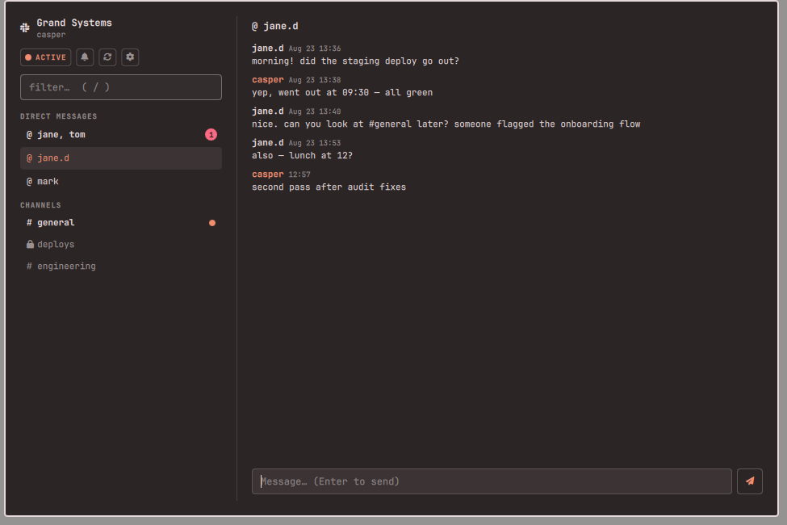

# Omarchy Slack

**Slack in Quickshell — not Chromium.**

Omarchy Slack brings your workspace into a fast, themed Omarchy app: read and
reply to DMs and channels, flip your presence, snooze notifications — while a
mention badge keeps watch in your bar. No Electron, no half-gigabyte client.



## Features

- **A full app, summoned instantly.** Click the bar icon (or bind a hotkey)
  and Slack opens as a real, movable, resizable window (the same model as the
  Spotify plugin): conversations in the sidebar, messages and a compose box on
  the right. `Esc` closes it.
- **Sign in with your browser.** One click sends you to Slack's own consent
  page; the token comes back to the plugin and goes straight into your
  system keyring. No copy-pasting API keys.
- **A badge that means something.** The bar icon counts unread DMs and group
  DMs in red — every one of those is aimed at you, across every workspace
  you're signed in to. Channel unreads light the icon and dot the sidebar.
- **Every workspace, one app.** Sign in to as many Slack workspaces as you
  like and switch between them from a rail of tiles down the left, each with
  its own unread badge — `Ctrl+1…9` jumps straight to one. The rail only
  appears once you have more than one workspace, so nothing changes if you
  don't need it.
- **Images, in and out.** Screenshots and photos shared in a conversation
  render in the message list; other attachments show as their name and size.
  Click one to fill the window with it — the original, not the thumbnail,
  fetched at that moment and then cached. To send one, take a screenshot and
  press `Ctrl+V` in the message box, or drop a file onto the conversation —
  there is no file dialog to wade through. Needs the `files:read` and `files:write` scopes; a token
  authorized before these existed keeps the scopes it was granted, so sign
  that workspace out and back in.
- **Presence & Do Not Disturb.** Toggle active/away and snooze notifications
  for an hour from the sidebar.
- **Made for Omarchy.** Every color comes from your active theme, light
  themes included. Keyboard-first: `↑`/`↓` move between conversations, `/`
  filters, `Enter` sends.

## Requirements

- Omarchy (Quattro shell) with a bar. Uses stock tools only: `bash`, `curl`,
  `jq`, `python3`. `secret-tool` (libsecret) is used for keyring storage when
  present, with a `0600` file fallback.
- A Slack account. Free and paid workspaces both work.

## Install

```sh
omarchy plugin add https://github.com/Bottelet/omarchy-slack.git --enable
omarchy bar put bottelet.slack --after omarchy.weather
```

Optional hotkey (Hyprland `bindings.lua`):

```lua
o.bind("SUPER + SHIFT + S", "Slack", "omarchy-shell shell toggle bottelet.slack")
```

Then click the Slack icon and press **Sign in with Slack**. Your browser
opens Slack's consent page; approve it and you're in.

To add a second workspace, open ⚙ in the app and press **Add another
workspace** — the same sign-in, and the token itself tells the plugin which
workspace it belongs to. Once you have two, the workspace rail appears.

The app opens as a normal window. Hyprland tiles new windows by default; to
have it float like a typical app, add to your Hyprland config:

```
windowrulev2 = float, title:^(Omarchy Slack)$
windowrulev2 = size 980 720, title:^(Omarchy Slack)$
windowrulev2 = center, title:^(Omarchy Slack)$
```

## How sign-in works

The default path is **paste a token**: follow `docs/OWN-APP.md` to create a
personal Slack app (two minutes) and paste its User OAuth Token. The token is
stored in your GNOME keyring when one is available, else in a private file.
No third party is involved at any point.

Browser sign-in exists but is deliberately **not configured out of the box**.
Slack, unlike Spotify, has no PKCE and requires an HTTPS redirect, so the
`code → token` exchange must run on a server holding the client secret — and
whoever operates that server momentarily handles your user token. That is a
trust decision only you should make, so this plugin ships no default proxy:
if you want the browser flow, deploy your own stateless Cloudflare Worker
(`oauth-proxy/README.md`), then point `~/.config/omarchy-slack/oauth.json` at
your own app and your own proxy. The "Sign in with Slack" button appears once
that file validates, and the whole flow then runs on infrastructure you
control: loopback listener, your proxy, your keyring.

### Optional: sync read state to your other Slack clients

Reading a conversation here always clears the badge locally. If you also want
it marked read on your phone and in the Slack apps, the Slack app needs the
extra write scopes (`channels:write`, `groups:write`, `im:write`,
`mpim:write`). They're heavier permissions, so they're not requested by
default; without them Slack keeps its own read state and the plugin quietly
skips the sync.

**Paste-a-token** already includes them: the `docs/OWN-APP.md` manifest asks
for all four.

**Browser sign-in** omits them unless you opt in, because the consent screen
should not ask for write access nobody wanted. To turn it on, add
`"sync_read_state": true` to `~/.config/omarchy-slack/oauth.json`:

```json
{
  "client_id": "…",
  "proxy_url": "https://…workers.dev",
  "sync_read_state": true
}
```

Your Slack app must also declare those four scopes under **OAuth &
Permissions → User Token Scopes**, or Slack rejects the authorize request with
`invalid_scope`. Scopes are fixed at authorization, so a workspace you signed
in to earlier keeps the scopes it was granted — sign out of it and back in to
pick up the new ones. `slack.sh login-available` prints the exact scope list
that will be requested.

Mixing the two paths across workspaces is where this bites: a workspace added
by browser sign-in without the opt-in will silently *not* sync read state,
while a pasted-token workspace in the same app will.

## Rate limits, honestly

Slack gives personal (non-Marketplace) apps created after May 2025 one
`conversations.history` request per minute, 15 messages at a time. These
budgets are per app *per workspace*, so signing in to several does not make
any one of them tighter. The plugin is built around that budget: opening a
conversation fetches live, refreshes are cached for a minute, your own
replies are appended locally instead of refetched, and the open conversation
re-polls once a minute. Unread counts use different (roomier) API methods and
poll every 3 minutes by default (`omarchy bar set bottelet.slack
refreshMinutes N`), fetching all your workspaces in parallel.

There is no bulk unread endpoint for a user token, so each conversation costs
one request and only 30 of them fit in a cycle. Rather than always checking
the same 30, the plugin spends that budget on whatever has been active in the
last 90 minutes and fills the rest with whatever it has gone longest without
checking — so a busy conversation refreshes every cycle and the whole list
still rotates through in a few. A conversation not checked this cycle keeps
the count it was last seen with instead of reporting zero. Set
`MAX_CONV_INFO` or `HOT_SECONDS` in the environment to retune it.

## Privacy & security

- Your Slack password is only ever typed on Slack's own pages.
- Each workspace's token lives in your system keyring (`secret-tool`, under
  `service omarchy-slack key ws-token team <workspace-id>`), or in
  `~/.config/omarchy-slack/tokens/<workspace-id>` with
  `0600` permissions when no keyring is available — never in `shell.json`,
  never in the repo. `~/.config/omarchy-slack/workspaces.json` records only
  which workspaces exist and which is active; it never holds a token.
- The token and the OAuth client secret are passed to `curl` via stdin or
  in-memory header files — they never appear on a command line or in
  `/proc`.
- All requests go to `slack.com` over HTTPS only (`--proto '=https'`),
  responses are size-capped, and every channel id is regex-validated before
  use. Names, errors and reactions render as plain text; message bodies render
  a small, safe mrkdwn subset (bold/italic/strike/code) via `Text.StyledText`
  where the content is fully HTML-escaped first and only a fixed tag whitelist
  (`<b> <i> <s> <font> <br>`) is ever emitted — no ``, `<a>`, or `src`,
  so nothing can fetch a remote resource.
- Avatars are downloaded only from Slack's own image hosts (no redirects
  followed), size-capped, checked to be a real raster format, and converted
  with ImageMagick resource limits before display.
- Uploads go only to the signed URL Slack hands back, and only after that URL
  is checked to be on `slack.com` over HTTPS — the URL is itself the
  credential, so the token is never sent to it. The file travels on `curl`'s
  stdin rather than inside a `-F` value, where `;` and `,` carry meaning that
  a dropped path could otherwise smuggle in, and the name Slack displays is
  reduced to a plain `[A-Za-z0-9._-]` basename. Pasting takes whatever image
  the Wayland clipboard holds, verified to really be a JPEG or PNG, into a
  `0600` file under your cache; abandoned pastes are cleared after an hour.
- Message images are fetched only from `files.slack.com`, size-capped, and
  cached `0600` under the workspace's own directory, keyed by Slack's file
  id. Full-size originals are fetched only when one is actually opened, from
  a URL the plugin itself produced and re-checks. A token lacking `files:read` is not refused — Slack answers `200` with
  an HTML sign-in page — so the bytes are checked to be a real JPEG or PNG
  before anything is kept or shown; anything else is discarded. The UI is
  only ever handed a local path, never a URL, so no view can be made to
  fetch a remote resource. Cached images not read for 30 days are removed.
- The OAuth listener binds `127.0.0.1` only, accepts a single
  state-validated callback, and dies after four minutes. The client secret
  lives only in the OAuth proxy (a Cloudflare Worker env var), never in this
  repo; the proxy is stateless and logs nothing. Your token reaches your
  machine over loopback and goes straight into the keyring.
- Message caches and read markers live in `~/.cache/omarchy-slack` with
  `0700`/`0600` permissions — private to your user, like the token. Each
  workspace gets its own subdirectory: Slack user ids are only unique within
  a workspace, so a shared cache would put the wrong name and face on a DM.
  Workspace ids are validated against `^[TE][A-Z0-9]+$` before they are ever
  used as a path.
- Like every native app with browser sign-in (GitHub CLI included), the
  shipped OAuth client credentials are public. They can't read anyone's
  Slack: a token is only ever issued to the person who completes the consent
  screen, and it goes only to their local keyring.
- **Sign out** (⚙ in the app) removes that workspace's token, its cache and
  its read markers, leaving your other workspaces alone; **Sign out of all
  workspaces** removes everything.

## Remove

```sh
omarchy plugin remove bottelet.slack
```

Removing the plugin keeps your tokens and caches. To wipe those too, use
**Sign out of all workspaces** first, or run:

```sh
bash ~/.config/omarchy/plugins/bottelet.slack/scripts/slack.sh clear-token --all
```

which clears every workspace's keyring entry and cache, or by hand:

```sh
secret-tool clear service omarchy-slack key ws-token   # every workspace
secret-tool clear service omarchy-slack key token      # pre-1.1 installs
rm -rf ~/.config/omarchy-slack ~/.cache/omarchy-slack
```

(`secret-tool` matches on a subset of attributes, so the first command
removes every workspace's token at once.)

To revoke server-side, remove "Omarchy Slack" under your Slack workspace's
**Apps** page.

## Tests

`tests/run.sh` — an offline suite (stub `curl`, no token needed) covering
command routing, input validation, history caching, rate-limit fallbacks,
per-workspace isolation, migration from a single-workspace install, the
OAuth listener, and that secrets never touch a process command line. Where
`node` is present it also runs the argv `Model.js` builds against the real
script, so the QML-to-shell contract is checked too.

---

Omarchy Slack is an independent project and is not affiliated with Slack
Technologies or Salesforce. Slack is a trademark of Slack Technologies, LLC.

Licensed under the [MIT License](LICENSE).
